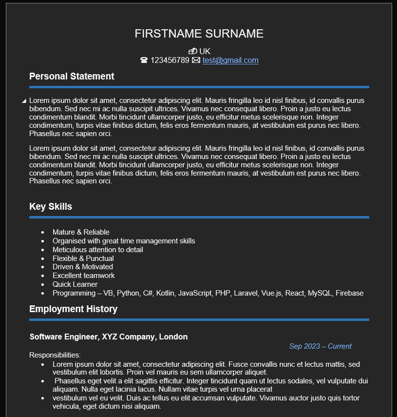
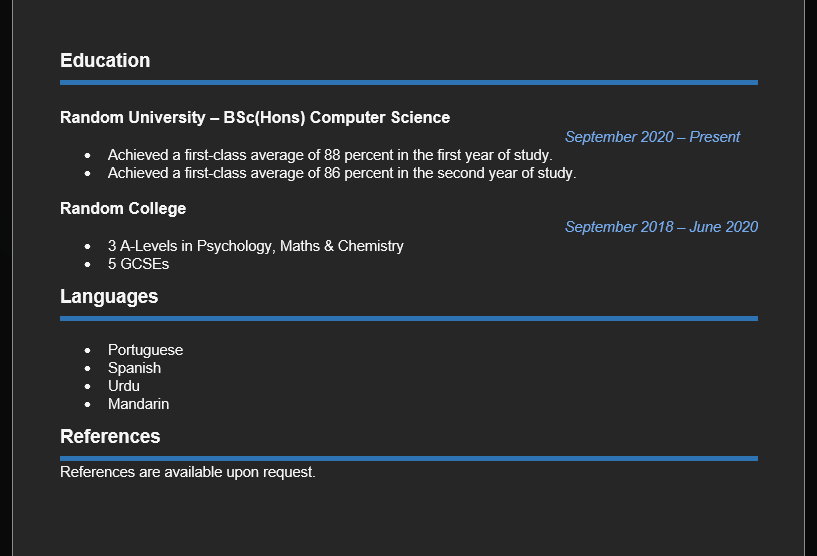

# CV Generator

## Overview

This Python script generates a CV in Microsoft Word. It prompts the user for personal information, education details, work experience, skills, and other relevant information, and generates a formatted CV accordingly.

## Requirements

- Python 3
- python-docx
- pyinputplus

## Usage

1. Clone the repository:
   ```bash
   git clone https://github.com/FurqanRaheem/CV.git
   cd CV

2. Install dependencies:
   ```bash
   pip install -r requirements.txt

3. Run the script:
   ```
   python CV.py
4. Follow the prompts to input your information.

## Output
The CV will be generated as cv.docx in the current directory.



